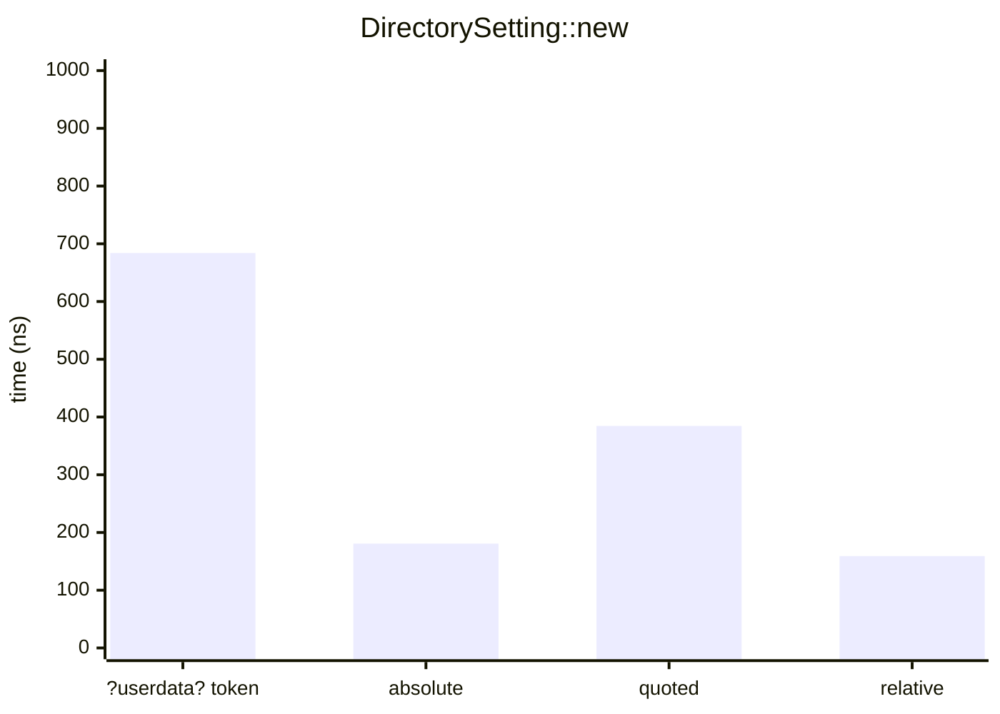
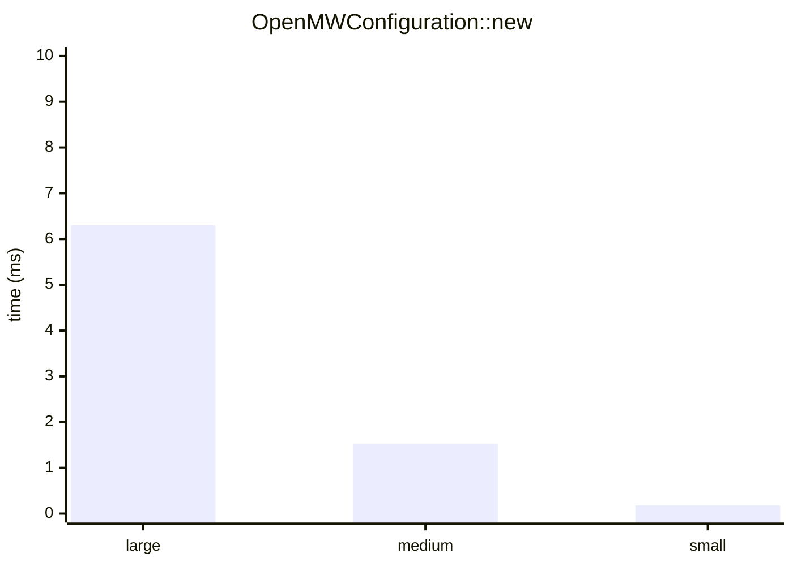
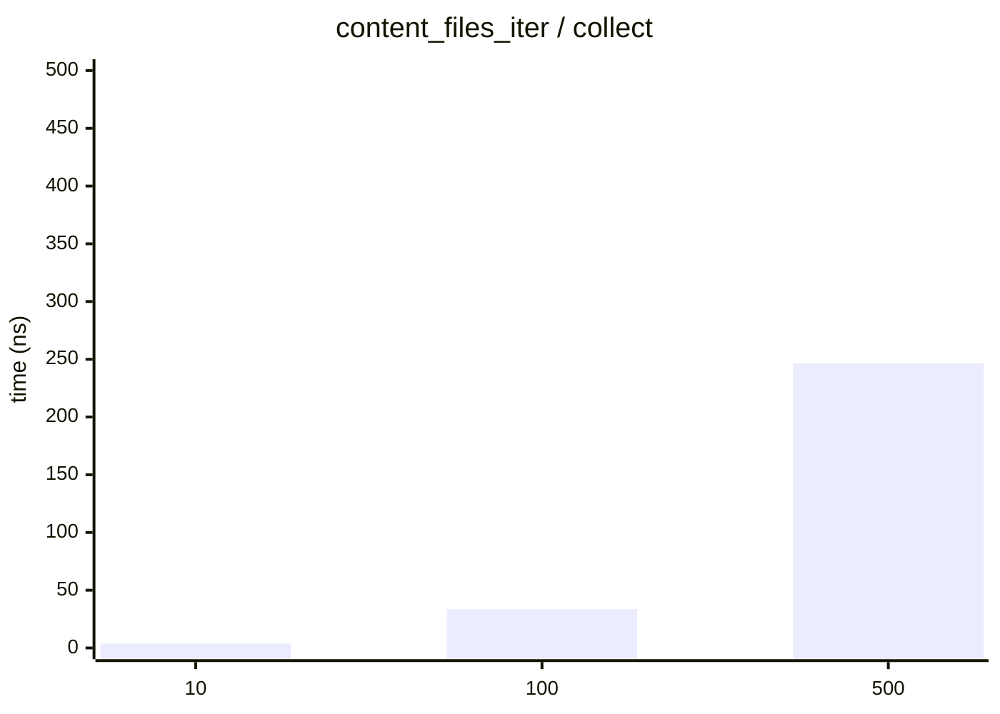
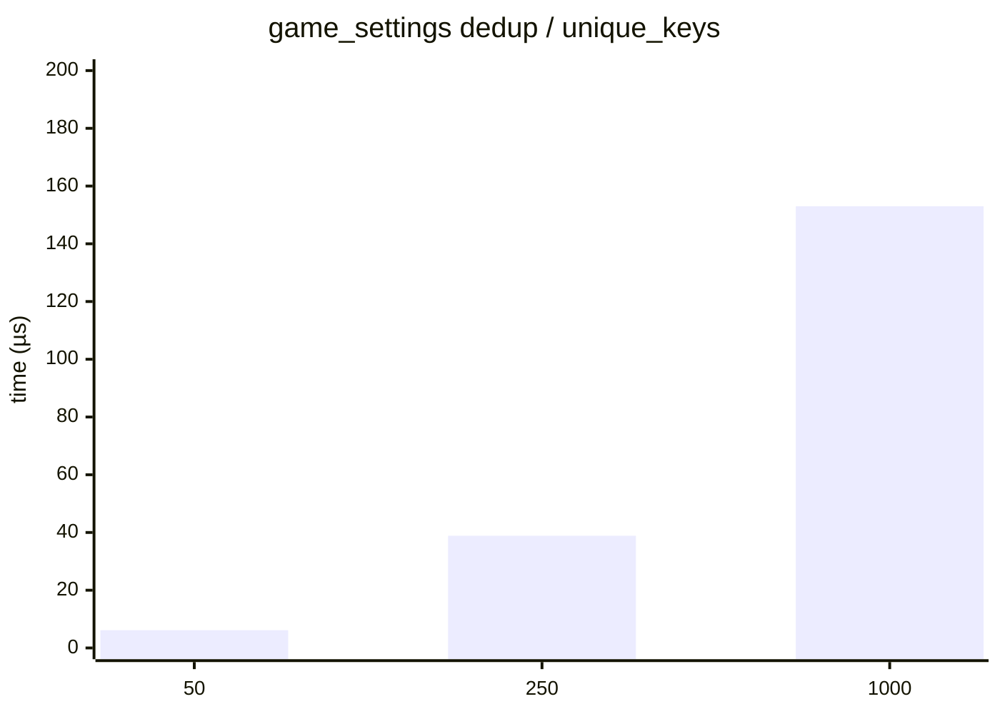
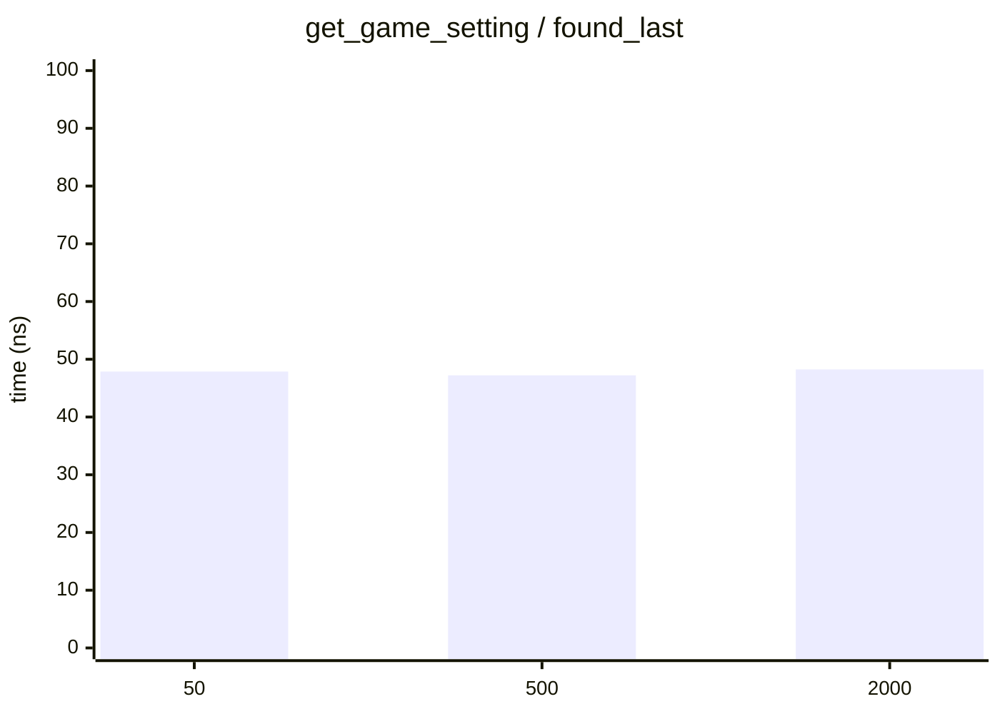
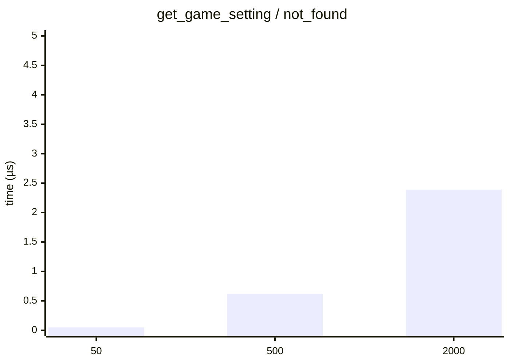
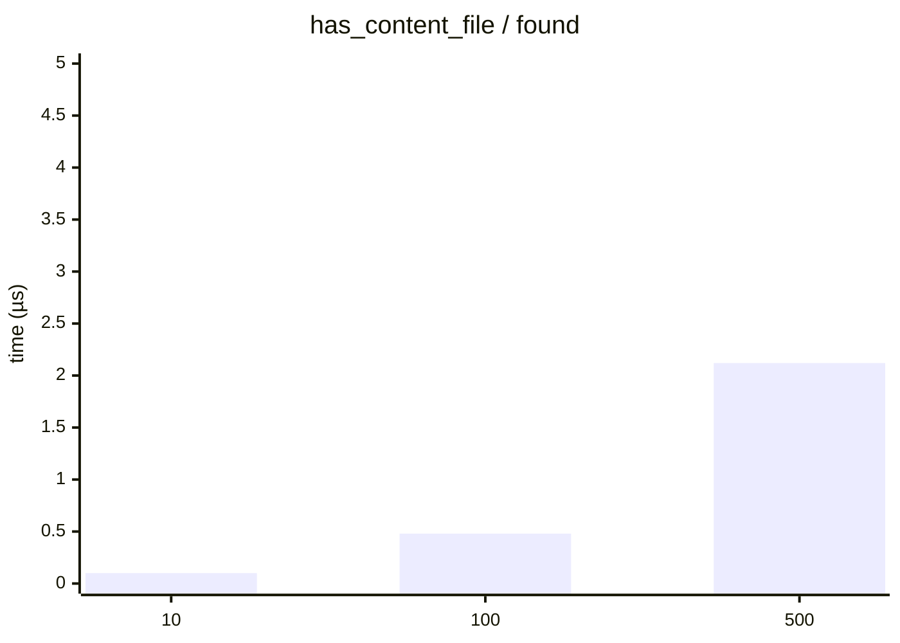
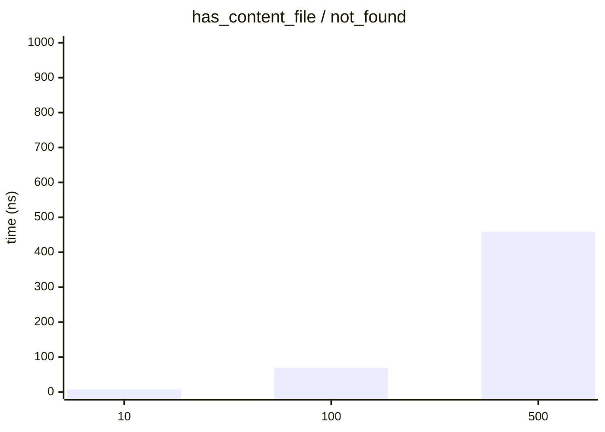

# Benchmarks

> Generated 2026-04-12 · `cargo bench --bench parsing` → Criterion → [scripts/gen_benchmarks.py](scripts/gen_benchmarks.py)

All times are wall-clock means measured by [Criterion.rs](https://github.com/bheisler/criterion.rs) (95 % confidence interval).

## DirectorySetting::new

| Variant | Mean | ± Std Dev |
|---|---:|---:|
| ?userdata? token | 684.0 ns | 11.86 ns |
| absolute | 180.7 ns | 3.44 ns |
| quoted | 384.6 ns | 3.17 ns |
| relative | 159.1 ns | 2.21 ns |

## OpenMWConfiguration::new

| Variant | Mean | ± Std Dev |
|---|---:|---:|
| large (200 dirs, 500 plugins, 2000 fallbacks) | 6.30 ms | 0.05 ms |
| medium (50 dirs, 100 plugins, 500 fallbacks) | 1.53 ms | 0.07 ms |
| small (10 dirs, 10 plugins, 50 fallbacks) | 0.18 ms | 0.00 ms |

## content_files_iter

| n | collect |
|---|---:|
| 10 | 3.75 ns |
| 100 | 33.63 ns |
| 500 | 246.4 ns |

**collect**

## game_settings dedup

| n | unique_keys |
|---|---:|
| 50 | 6.15 µs |
| 250 | 38.87 µs |
| 1000 | 153.0 µs |

**unique_keys**

## get_game_setting

| n | found_last | not_found |
|---|---:|---:|
| 50 | 0.05 µs | 0.05 µs |
| 500 | 0.05 µs | 0.62 µs |
| 2000 | 0.05 µs | 2.39 µs |

**found_last**

**not_found**

## has_content_file

| n | found | not_found |
|---|---:|---:|
| 10 | 0.10 µs | 0.01 µs |
| 100 | 0.48 µs | 0.07 µs |
| 500 | 2.12 µs | 0.46 µs |

**found**

**not_found**

