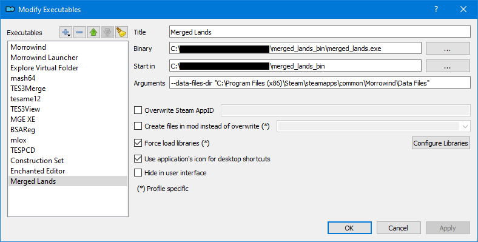
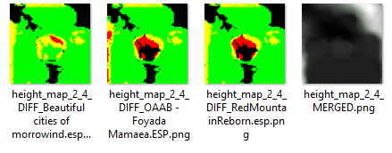
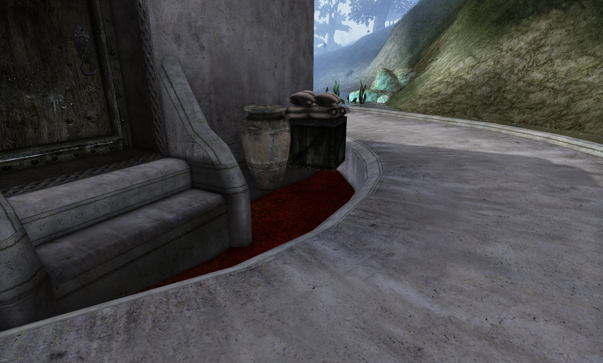
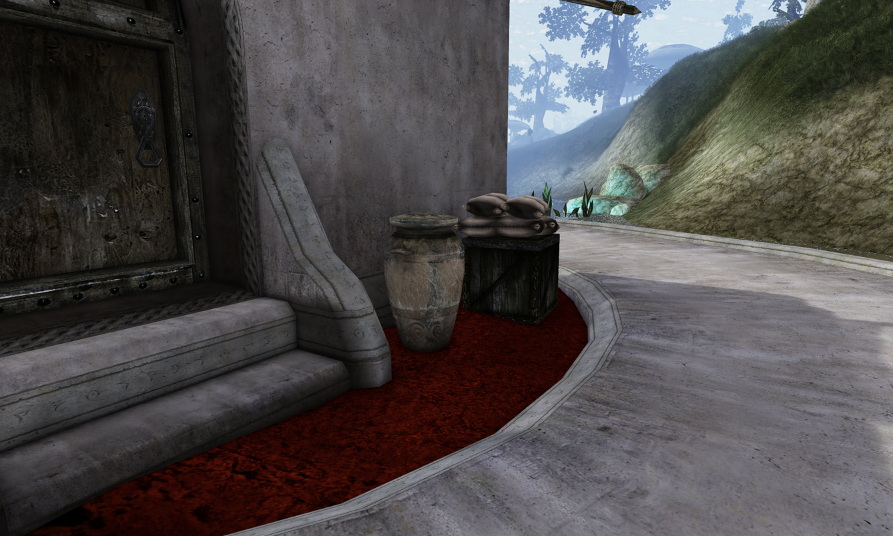

# Merged Lands

`merged_lands.exe` is a tool for merging land in TES3 mods.

The [Merged Lands website](https://sophialovesmorrowind.github.io/OpenMWMergedLands/)
provides platform downloads, checksums, and usage instructions.

The output of the tool is a plugin called `Merged Lands.omwaddon` in OpenMW mode, or
`Merged Lands.esp` in classic `--vanilla` mode. It should go at the end of your load order.
Yes, that includes after `Merged Objects.esp` if you're using `TES3Merge`.

The plugin contains a merged representation of `LAND` records and the `LTEX` records needed by them. It does not load or emit `CELL` records.

The tool works with both OpenMW (reading `openmw.cfg`) and the original Morrowind engine
(reading `Morrowind.ini`). OpenMW is the default mode. See [OpenMW Support](#openmw-support)
below for details.

## Downloads

Download and extract the ZIP for your platform from the
[latest release](https://github.com/Sophialovesmorrowind/OpenMWMergedLands/releases/latest).
Each release also includes SHA-256 and SHA-512 checksum files for every ZIP.

| Platform | Download |
| --- | --- |
| Windows x86-64 | [Windows ZIP](https://github.com/Sophialovesmorrowind/OpenMWMergedLands/releases/latest/download/merged_lands-windows-amd64.zip) |
| Linux x86-64 | [Linux x86-64 ZIP](https://github.com/Sophialovesmorrowind/OpenMWMergedLands/releases/latest/download/merged_lands-linux-amd64.zip) |
| Linux ARM64 | [Linux ARM64 ZIP](https://github.com/Sophialovesmorrowind/OpenMWMergedLands/releases/latest/download/merged_lands-linux-arm64.zip) |
| macOS Intel | [macOS Intel ZIP](https://github.com/Sophialovesmorrowind/OpenMWMergedLands/releases/latest/download/merged_lands-macos-amd64.zip) |
| macOS Apple Silicon | [macOS Apple Silicon ZIP](https://github.com/Sophialovesmorrowind/OpenMWMergedLands/releases/latest/download/merged_lands-macos-arm64.zip) |
| Android ARM64 | [Android ARM64 ZIP](https://github.com/Sophialovesmorrowind/OpenMWMergedLands/releases/latest/download/merged_lands-android-arm64.zip) |

## How?

1. The tool builds a "reference" landmass by merging all `.ESM` plugins using a similar algorithm as Morrowind.
2. The tool calculates a "difference" landmass for each mod _with respect to the reference landmass_.
3. The tool copies the "reference" landmass into a new "merged" landmass.
4. For each "difference" landmass from a plugin, the tool merges it into the "merged" landmass. If mods do not overlap with their changes, the resulting terrain will perfectly match both mods' intended changes. If there _is_ overlap, the tool will attempt to resolve the conflicts in an intelligent manner.
5. The "merged" landmass is checked for seams and repaired if necessary.
6. The "merged" landmass is converted into the `TES3` format and saved as a plugin.

## Limitations

- The tool does NOT move entities within the cell. This may result in floating or buried objects. This may include grass from any grass mods, or similar landscape detailing.
- The tool does NOT perform magic. If one mod puts a hill in the exact same spot another mod tries to put a valley, the resulting land will likely be less than appealing.

## Installation & Usage

1. Create a folder for the tool's executable, e.g. `merged_lands_bin`.
2. Create a directory in that folder called `Conflicts`.
3. Place the executable in the `merged_lands_bin` folder.

You should have a directory tree that looks like the following:

```
merged_lands_bin\
    merged_lands.exe
    Conflicts\
```

To run the tool, open a terminal (e.g. `cmd`) in the `merged_lands` directory.

By default, the tool follows OpenMW's installed engine configuration and its `config=` profiles,
respecting `OPENMW_CONFIG` / `OPENMW_CONFIG_DIR`. Without an engine base config, it reads the
platform-default user `openmw.cfg`.

```bash
# Default OpenMW behavior
merged_lands_bin> .\merged_lands.exe

# Classic Morrowind / vanilla behavior
merged_lands_bin> .\merged_lands.exe --vanilla --data-files-dir "C:\Program Files (x86)\Steam\steamapps\common\Morrowind\Data Files"
```

An example configuration for `MO2` is shown below.



### Outputs

By default, the tool will save the output `Merged Lands.omwaddon` in OpenMW's `data-local`
directory. If `openmw.cfg` sets `data-local=`, that exact path is used; otherwise the tool falls
back to the platform-default OpenMW `data-local` path for the current OS.

In classic Morrowind mode (`--vanilla`), it instead defaults to `Merged Lands.esp` in the
`Data Files` directory.

This can be changed with the `--output-file-dir` and `--output-file` arguments.

If you want a persistent custom output directory without passing `--output-file-dir` every time,
set `output_file_dir` in the application config file. See
[Application Config](#application-config).

### Application Config

The tool keeps application-level settings in `merged_lands.toml`. This file is separate from
per-plugin `.mergedlands.toml` patch files.

By default, `merged_lands.toml` is created in the same config directory OpenMW uses:

| OS | Default config directory |
| --- | --- |
| Linux | `$XDG_CONFIG_HOME/openmw` or `$HOME/.config/openmw` |
| macOS | `$HOME/Library/Preferences/openmw` |
| Windows | `Documents\My Games\OpenMW` |
| Android | `/storage/emulated/0/Alpha3/config` |

If the OpenMW config directory cannot be used, the tool falls back to writing `merged_lands.toml`
next to the executable. You can override the config location with `--config-dir`.

If `merged_lands.toml` does not exist, it is created during startup. OpenMW configuration is
always auto-detected when neither `--openmw-cfg` nor a saved `openmw_cfg` path is set. First runs
start merging immediately without a configuration selector. To use a different configuration,
pass `--openmw-cfg` or set `openmw_cfg` in `merged_lands.toml`.

The file is also updated after a successful run to record generated output names. On first creation
only, it is seeded with a default ignore list for generated or non-land-merge plugins that are
expensive or unhelpful to parse:

```toml
ignore_plugins = [
    "delta-merged.omwaddon",
    "deleted_groundcover.omwaddon",
    "groundcover.omwaddon",
    "S3LightFixes.omwaddon",
    "OMWLLFMod.omwaddon",
    "merged.omwaddon",
    "Merged Objects.esp",
]
```

Existing config files are not overwritten with new defaults. Edit the list if your setup needs
different behavior.

New configs also include a plugin-specific exception for Tamriel Rebuilt's Hunza Camp:

```toml
[cell_ignore_by_plugin]
"TR_Mainland.esm" = [[-9, -46], [-9, -47], [-10, -46], [-10, -47]]
```

These four cells are skipped before merging and seam repair. When TR is their only terrain
source, the generated plugin contains no LAND overrides for them, leaving TR's original
terrain in-game. Other TR cells continue to merge normally. To apply this exception to an
existing config, add the entry to its `[cell_ignore_by_plugin]` table, after all top-level
settings. To opt out, remove the entry or set it to `[]`.

The [Hunza Camp investigation](docs/hunza-camp.md) describes the source discontinuity and
why averaging it can lower the surrounding landscape.

Supported settings:

```toml
# Persistent OpenMW config path. Used only when --openmw-cfg is not passed.
openmw_cfg = "/home/me/.config/openmw/openmw.cfg"
# Windows paths can use TOML literal strings to avoid escaping backslashes.
# openmw_cfg = 'C:\Users\Username\Documents\My Games\OpenMW\openmw.cfg'

# Persistent output directory. Used only when --output-file-dir is not passed.
# Relative paths are resolved relative to the directory containing merged_lands.toml.
output_file_dir = "/absolute/path/to/output"
# output_file_dir = 'C:\Users\Username\Documents\My Games\OpenMW\Merged Output'

# Skip these plugin names before parsing.
ignore_plugins = ["Some Generated Plugin.omwaddon"]

# Skip plugins resolved from these directories before parsing.
# Relative paths are resolved relative to the directory containing merged_lands.toml.
ignore_plugins_from_path = ["/absolute/path/to/generated/plugins"]
# ignore_plugins_from_path = ['C:\Users\Username\Documents\My Games\OpenMW\Generated']

# Exterior cell coordinates [x, y] to exclude from every plugin and the merged output.
cell_ignore = [[-2, 3], [0, 0]]

# Managed by the tool. Used to avoid parsing previous outputs if they still exist.
# Fresh configs use "default_data_local" until the first successful run records the real path.
# Relative paths are resolved relative to the directory containing merged_lands.toml.
generated_output_dir = "default_data_local"
# generated_output_dir = "/absolute/path/to/output"
# generated_output_dir = 'C:\Users\Username\Documents\My Games\OpenMW\Merged Output'

# Managed by the tool. Output plugin names previously written to generated_output_dir.
generated_output_files = ["Merged Lands.omwaddon"]

# Skip only the named plugin's changes to these cells.
# Keep this table after the top-level settings above.
[cell_ignore_by_plugin]
"Some Landscape Mod.esp" = [[4, -5], [6, 7]]
"Some Expansion.esm" = [[8, 9]]
```

Cells use exterior grid coordinates, not cell names. Both settings are optional and default to
empty. `cell_ignore` excludes the entire cell from merging, seam repair, and output.
`cell_ignore_by_plugin` skips all terrain data from the named plugin at the listed cells while
allowing earlier and later plugins to contribute there. Plugin filenames include their extension
and match without regard to ASCII case; entries for plugins outside the selected load order have
no effect. Both settings work in OpenMW and `--vanilla` modes, and global exclusions take priority.

If a skipped plugin supplied the only terrain for a cell, the tool has no replacement to write;
the original plugin still supplies that terrain in-game. Where earlier terrain exists, the merged
output can restore it. Texture-only earlier records are omitted when the ignored winning plugin
supplies the cell's heights, because a heightless LAND override would discard those heights.
Seam repair still applies to cells supplied by other plugins.

Output directory precedence is:

1. `--output-file-dir`
2. `output_file_dir` in `merged_lands.toml`
3. OpenMW `data-local` in OpenMW mode
4. `--data-files-dir` in classic `--vanilla` mode

### Troubleshooting Merges

The tool will save the log file to the `--merged-lands-dir`. This defaults to `.`, or "the current directory".

The tool will save images to a folder `Conflicts` in the `--merged-lands-dir`.

```
merged_lands_bin\
    merged_lands.exe
    merged_lands.log   <-- Log file.
    Conflicts\
        ...            <-- Images of conflicts.
```

A conflict image shows `green` where changes were merged without any conflicts, whereas `yellow` means a minor conflict occurred, and `red` means a major conflict occurred. 
In addition, the tool creates `MERGED` map showing the final result.

**Note:** Each conflict image is created relative to a specific plugin. This makes it easier to understand how the final land differs from the expectation of each plugin.



In addition, the tool can be run with the `--add-debug-vertex-colors` switch to color the actual `LAND` records saved in the output file.
This feature can help with understanding where a conflict shown in the `Conflicts` folder actually exists in-game and the severity of it with respect to the world.



### Other Configuration

Run the tool with `--help` to see a full list of supported arguments.

## OpenMW Support

The tool can discover plugins and data directories by reading an `openmw.cfg` file instead of
`Morrowind.ini`. This is useful if you manage your mods with OpenMW or a mod manager that writes
to `openmw.cfg` (e.g., OpenMW Launcher, MO2 with an OpenMW configuration, Portmod).

### OpenMW is the default

If you do not pass any mode flag, the tool runs in OpenMW mode. Config source precedence is:

1. `--openmw-cfg`
2. `openmw_cfg` in `merged_lands.toml`
3. OpenMW auto-detection

The built-in loader checks `OPENMW_CONFIG` first (a file or directory), then searches
`OPENMW_CONFIG_DIR` in order for the first `openmw.cfg`, then checks the OpenMW executable's
local `openmw.cfg` and the stock Unix global config at `/etc/openmw/openmw.cfg`. If neither
exists, it uses the platform-default user config directory above. The engine base config's
`config=` entries select the user profile; no additional user config is implicitly appended.
`OPENMW_CONFIG_DIR` is a colon-separated path list on Unix and a
semicolon-separated list on Windows. Leading `~` is expanded for explicit paths and environment
overrides. An invalid explicit path reports an error instead of silently selecting another config.

Linux respects `XDG_CONFIG_HOME` and `XDG_DATA_HOME`. Existing Flatpak detection is retained:
`OPENMW_CONFIG_USING_FLATPAK`, `FLATPAK_ID`, or `/.flatpak-info` selects
`~/.var/app/<app-id>/config/openmw` and `~/.var/app/<app-id>/data/openmw`.
The app ID comes from `OPENMW_FLATPAK_ID`, then `FLATPAK_ID`, then `org.openmw.OpenMW`.
Windows uses the OS Documents-folder API, including redirected folders such as OneDrive.
Android defaults to the Alpha3 directory shown above.

You can still override the config path with `--openmw-cfg <PATH>`, where `<PATH>` may be either
a directory containing `openmw.cfg` or a direct path to the file. Example:

```bash
# Use saved openmw_cfg, or auto-detect if none is saved
merged_lands

# Explicit path
merged_lands --openmw-cfg "/home/me/.config/openmw"
merged_lands --openmw-cfg "/home/me/.config/openmw/openmw.cfg"
```

```powershell
# Explicit Windows path
merged_lands --openmw-cfg 'C:\Users\Username\Documents\My Games\OpenMW'
merged_lands --openmw-cfg 'C:\Users\Username\Documents\My Games\OpenMW\openmw.cfg'
```

To use classic Morrowind behavior instead, pass `--vanilla`.

### Config syntax and profiles

Config loading is implemented in this repository, following OpenMW's
[configuration manager](https://github.com/OpenMW/openmw/blob/master/components/files/configurationmanager.cpp)
and [path syntax](https://openmw.readthedocs.io/en/stable/reference/modding/paths.html).
The selected file is the root of the chain; it can point to profile directories with `config=`.
The loader handles nested configs, repeated/circular references, `replace=data`, `replace=content`,
`replace=config`, and `replace=replace`. For nested ordering it follows the engine source: the first listed config
and its descendants load before the next sibling. A missing optional config is skipped; an
unreadable or malformed existing config reports its path and, for syntax errors, its line.

Paths are relative to the file declaring them. Quoted paths use `&` to escape the next character;
backslashes stay literal, and text after a closing path quote is ignored. Only whole lines starting
with `#` are comments; a `#` inside a value remains part of that value. Unknown engine settings
are ignored. Content values are literal filenames: write `content=Plugin.esp`; quotes in
`content="Plugin.esp"` remain part of the filename, as they do in OpenMW. Duplicate `data-local`
or `resources` settings in one file are errors; higher config layers can override them.

The `?userconfig?` and `?userdata?` tokens refer to the standard platform locations, independent
of the selected profile and `user-data=`. `?local?` uses the OpenMW executable found beside this
tool, on `PATH`, or in the standard Windows/macOS installation location; it falls back to the
tool's directory. `?global?` uses `/usr/share/games/openmw` on Linux and
`/Library/Application Support/openmw` on macOS. For custom engine installation layouts, use
explicit paths in the config. Append relative token suffixes directly, such as `?userdata?data`.
A suffix beginning with `/` replaces the token's directory on Unix, matching OpenMW's path
handling. Parsing does not edit config files or create directories. See the
[compatibility audit](docs/openmw-config-compatibility.md) for verified cases and remaining scope.

### What changes in OpenMW mode

- **Data directories.** Plugins and their `.mergedlands.toml` meta files are searched across every
  `data=` entry from the config chain, in reverse priority order (OpenMW's VFS rule — later `data=`
  lines win). This includes any engine-added entries such as the resources VFS and `data-local`.
- **Load order.** The tool uses the `content=` order from `openmw.cfg` verbatim. No mtime sorting
  is applied, because the cfg's ordering is already the user's authoritative load order.
- **Output location.** If `--output-file-dir` is not set, `Merged Lands.omwaddon` is written to the
  OpenMW `data-local` directory. If `openmw.cfg` omits `data-local=`, the tool uses the
  platform-default OpenMW `data-local` path instead. Classic mode (`--vanilla`) still defaults
  to writing `Merged Lands.esp` in `--data-files-dir`.
- **`--data-files-dir` is only used for plugin discovery in `--vanilla` mode.**

### Builds and releases

[The GitHub Actions workflow](.github/workflows/release.yaml) uses the exact Rust version in
[`rust-toolchain.toml`](rust-toolchain.toml) for checks and release builds, matching local Cargo
commands. The crate requires Rust 1.99.0. CI logs compiler and Cargo versions and runs formatting,
strict Clippy and package tests. It builds Linux x86-64
and ARM64, macOS Intel and Apple Silicon, Windows x86-64, and Android ARM64, matching GoCoverify's
platform set. Desktop builds run tests and the CLI help command on native runners; Android is
cross-compiled with the NDK and is not device-tested. Linux packages are built on Ubuntu 24.04
and require a compatible glibc. Android is a command-line binary for an executable app-private
directory (for example, Termux), not an APK. Linux ARM64 provides the handheld build; no
PortMaster launcher is bundled.

Each build produces a platform ZIP containing the executable, `Conflicts/`, README, original
MIT license, and build information, plus SHA-256 and SHA-512 checksum files. User TOML files are
not packaged. Tagged builds verify the archives and publish them as GitHub release assets using
the built-in token, including when the release already exists. The release job confirms that all
six ZIPs and their checksum files are attached and writes download links to its job summary.
The workflow is self-contained and needs no custom secrets.

For example, to build and package Linux x86-64 locally:

```sh
cargo build --release --locked --target x86_64-unknown-linux-gnu
python3 ci/package.py linux-amd64 x86_64-unknown-linux-gnu --version development
python3 -m unittest discover -s ci -p 'test_*.py'
```

### Persistent output override

Set `output_file_dir` in `merged_lands.toml` to choose a persistent output directory:

```toml
output_file_dir = "Merged Output"
```

This is only used when `--output-file-dir` is not passed. Relative paths are resolved relative to
the directory containing `merged_lands.toml`. See [Application Config](#application-config) for
the full config behavior.

Plugin discovery can still be overridden by passing an explicit plugin list on the command line;
that list wins over whatever `openmw.cfg` says.

### ESP-as-master handling

Regardless of mode, the tool inspects each plugin's TES3 header and treats any plugin declared as
a master by another plugin as part of the reference landmass — even if its extension is `.esp`.
This is the correct behavior for mods that ship a parent ESP plus dependent patch ESPs (common
with OpenMW-centric mod compilations), and it matches how OpenMW itself resolves dependencies.

A message is logged at `debug` level when a plugin is promoted from a plugin to a master this way.

## Supporting Patches

The tool will automatically read per-plugin `.mergedlands.toml` files from the configured plugin
data directories. In classic `--vanilla` mode, that means the `Data Files` directory. In OpenMW
mode, the tool searches the configured `data=` directories using OpenMW-style VFS priority.

```bash
Data Files\
    Cantons_on_the_Global_Map_v1.1.esp
    Cantons_on_the_Global_Map_v1.1.mergedlands.toml
```

These files are used to control the tool's behavior.

### Example 1. `Cantons_on_the_Global_Map_v1.1.mergedlands.toml`

This patch file would instruct the tool to exclude all changes made by the mod except for those related to `world_map_data`.
Then, for those changes only, the mod would resolve any conflicts with other mods by using the changes from `Cantons on the Global Map` instead.

```toml
version = "0"
meta_type = "Patch"

[height_map]
included = false

[vertex_colors]
included = false

[texture_indices]
included = false

[world_map_data]
conflict_strategy = "Overwrite"
```

### Example 2. `BCOM_Suran Expansion.mergedlands.toml`

The Beautiful Cities of Morrowind Suran Expansion mod should load after `BCoM`. It modifies the same land, and we would like to prefer the changes from Suran Expanson over the normal `BCoM` edits. We can set each field to `"Overwrite"`.

```toml
version = "0"
meta_type = "Patch"

[height_map]
conflict_strategy = "Overwrite"

[vertex_colors]
conflict_strategy = "Overwrite"

[texture_indices]
conflict_strategy = "Overwrite"

[world_map_data]
conflict_strategy = "Overwrite"
```

The example conflict shown above in [Troubleshooting Merges](#troubleshooting-merges) is now fixed.



### Example 3. Ignoring Changes

If we'd like a mod to load after another mod and _not_ try to merge changes where those mods conflict, we can use the `"Ignore"` setting.
For example, if we knew that some mod would overwrite texture changes from an earlier mod, and we wanted to prevent that, we could do the following:

```toml
version = "0"
meta_type = "Patch"

[texture_indices]
conflict_strategy = "Ignore"
```

### Defaults

Each type of `LAND` record is `included = true` and `conflict_strategy = "Auto"` by default. `"Auto"` preserves load-order winner semantics: later plugins win for the LAND entries they actually changed. Use `"Resolve"` only when you explicitly want the tool to synthesize blended numeric values instead of following load order.
Setting `included = false` excludes that plugin's data from the merge and from the rolling reference used for later plugins. If another included field requires an output `LAND` record, the generated plugin may still write required `LAND` fields from an earlier winner so the excluded data does not win at the end of the load order.
You should not write a `.mergedlands.toml` file until it is known to be necessary.
